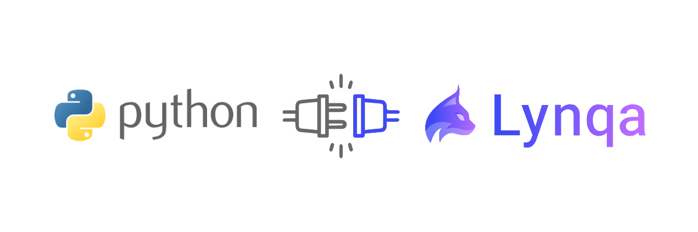

# pylynqa

[](https://github.com/petit-robot/pylynqa/actions/workflows/ci.yml)
[](https://github.com/petit-robot/pylynqa/actions/workflows/acceptance.yml)
[](LICENSE)


**pylynqa** is a Python client for the [Lynqa](https://lynqa.smartesting.com) REST API.



Lynqa is a test execution AI Agent: you describe a test (plain steps or a Gherkin scenario) and Lynqa runs it
against your web application. This library provides a wrapper around the REST API, covering test
run management, step inspection, screenshot retrieval, and account operations.

## Disclaimers

> [!IMPORTANT]
> **This is an unofficial project.** pylynqa is **not affiliated with, endorsed by, or maintained by
> [Smartesting](https://www.smartesting.com)**, the company that develops Lynqa. "Lynqa" and "Smartesting" are the
> property of their respective owners.

> [!NOTE]
> **Lynqa is a commercial product.** Using this client requires a Lynqa account and an API key, and running tests
> consumes paid credits. See <https://my.lynqa.smartesting.com/integration> to create an API key.

## Requirements

- Python 3.9+
- A Lynqa account and API key (test executions consume credits)

## Installation

```bash
pip install pylynqa
```

> At this early stage the package may not be published on PyPI yet. In the meantime you can install it from source:
>
> ```bash
> pip install git+https://github.com/petit-robot/pylynqa.git
> ```

## Quick start

```python
from pylynqa import CreateTestStep, LynqaClient

client = LynqaClient(api_key="your-api-key")

run_id = client.add_test_run(
    url="https://lemonde.fr",
    steps=[
        CreateTestStep(
            action="Go to the website",
            expected_result="The website is open",
        ),
        CreateTestStep(
            action='Search an article on "france ia"',
            expected_result='Should have an article on "IA agentique"',
        ),
    ],
    name="Smoke - Search an article",
)

status = client.get_test_run_status(run_id)
print(status["status"])  # e.g. "running"
```

## Bruno Collection

The project provides a Bruno Collection to interact with Lynqa API.
A Bruno environment named "production" was also provided in addition to the collection.

You can access the collection [here](utils/bruno-collection).

### Prerequisites
Before using this collection, make sure you have:
- Bruno 3.4.2+
- A valid Lynqa API Key that you get once you have a Lynqa account

### Where to put your API Key

To securely use the API, you must configure your API key inside a Bruno environment.

For that you should:
- Select the environment named "production".
- Click on "Configure" to get access to the environment variable

In the environment variable:
- Paste your Lynqa API Key in the Value field
- Make sure to mark it as Secret (enable the checkbox)
- Click Save

This ensures your API key is never exposed in Bruno files.

## Collaboration

This project is at an early stage, so **external contributions are limited for now**. This may be opened up more
broadly later as the project matures.

In the meantime, **you are very welcome to open an [issue](https://github.com/petit-robot/pylynqa/issues)** to report a
bug or ask any question.

## License

Licensed under the [Apache License 2.0](LICENSE).
